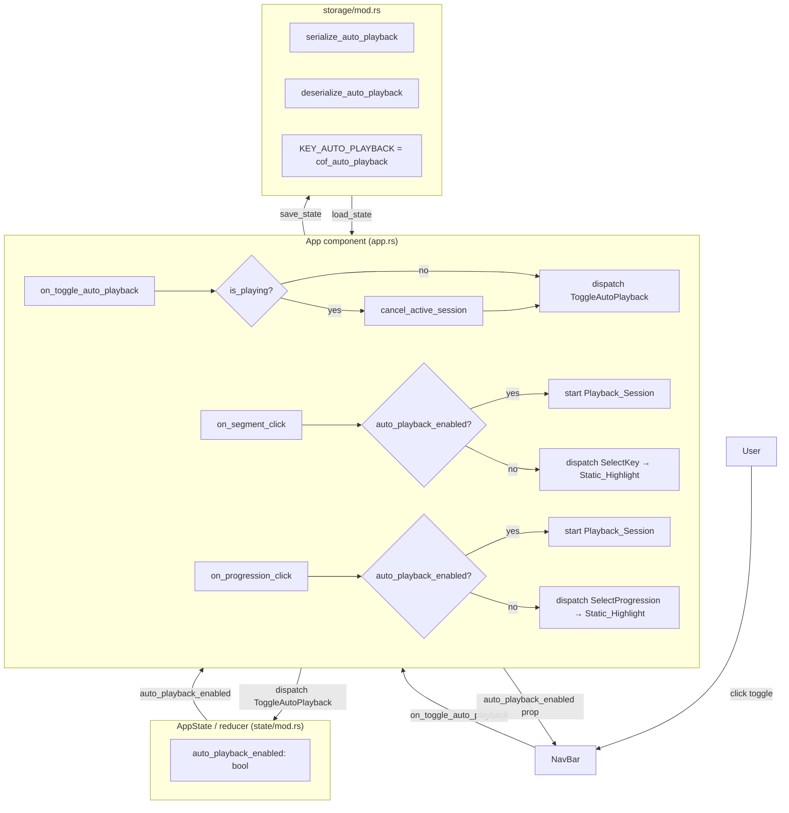

# Design Document: Auto-Playback Toggle

## Overview

The Auto-Playback Toggle adds a persistent boolean control that gates whether clicking a
circle segment or selecting a chord progression triggers a `Playback_Session` (audio +
sequential animation). When disabled, clicks produce an immediate `Static_Highlight` on the
piano with no audio. When enabled (the default), all existing behaviour is preserved exactly.

The feature touches four areas:

1. **State** — a new `auto_playback_enabled: bool` field in `AppState` and a
   `ToggleAutoPlayback` action in `AppAction`.
2. **Storage** — serialize/deserialize helpers for the new field, persisted under
   `cof_auto_playback`, following the same pattern as `muted` and `metronome_active`.
3. **App component** — guard clauses in `on_segment_click` and `on_progression_click` that
   skip the playback path when `auto_playback_enabled` is `false`; the toggle callback also
   calls `cancel_active_session` when disabling mid-session.
4. **NavBar component** — a new toggle button rendered alongside the existing Mute and
   Metronome buttons, wired through a new prop/callback pair.

No new crates are required. The implementation reuses `gloo_timers`, `serde`, and the
existing `cancel_active_session` pattern from the cancellable-playback feature.

---

## Architecture



Key design decisions:

- **Guard in `on_segment_click` / `on_progression_click`, not in the reducer** — the
  playback path involves `Timeout` handles and audio calls that live outside the reducer.
  The guard must sit in the `App` component where those resources are accessible.
- **`cancel_active_session` called on disable** — reuses the existing cancellation closure
  verbatim; no new cancellation logic is needed.
- **`ToggleAutoPlayback` in the reducer** — the toggle state is reactive UI state that drives
  the NavBar button label, so it belongs in `AppState` like `muted` and `metronome_active`.
- **Independent of mute** — `ToggleAutoPlayback` only flips `auto_playback_enabled`; it does
  not touch `muted`, and `ToggleMute` does not touch `auto_playback_enabled`.
- **Static_Highlight on disable** — when `auto_playback_enabled` is `false`, `SelectKey` is
  still dispatched so the piano shows the full scale highlight. For progressions,
  `SelectProgression` is dispatched so the first chord is highlighted. No extra action is
  needed; the existing reducer already produces the correct highlight state.

---

## Components and Interfaces

### `AppState` additions (`src/state/mod.rs`)

```rust
pub struct AppState {
    // ... existing fields ...
    pub auto_playback_enabled: bool,  // default: true
}
```

`Default` impl sets `auto_playback_enabled: true`.

### `AppAction` additions (`src/state/mod.rs`)

```rust
pub enum AppAction {
    // ... existing variants ...
    ToggleAutoPlayback,
}
```

Reducer handling:

```rust
AppAction::ToggleAutoPlayback => AppState {
    auto_playback_enabled: !state.auto_playback_enabled,
    ..state
},
```

### `PersistedState` additions (`src/storage/mod.rs`)

```rust
pub struct PersistedState {
    // ... existing fields ...
    pub auto_playback_enabled: bool,
}
```

New pure helpers:

```rust
const KEY_AUTO_PLAYBACK: &str = "cof_auto_playback";

pub fn serialize_auto_playback(enabled: bool) -> String {
    if enabled { "true".to_string() } else { "false".to_string() }
}

pub fn deserialize_auto_playback(s: &str) -> bool {
    // Defaults to true on any unrecognised value (Requirement 6.4)
    s == "true"
}
```

`load_state` reads `KEY_AUTO_PLAYBACK` and defaults to `true` when absent or unrecognised.
`save_state` writes `auto_playback_enabled` via `serialize_auto_playback`.

### `App` component changes (`src/components/app.rs`)

**State initialisation** — restore `auto_playback_enabled` from `PersistedState`:

```rust
s.auto_playback_enabled = persisted.auto_playback_enabled;
```

**Persistence effect** — add `state.auto_playback_enabled` to the dependency tuple of the
`save_state` `use_effect_with` hook.

**`on_toggle_auto_playback` callback**:

```rust
let on_toggle_auto_playback = {
    let state = state.clone();
    let animation_handles = animation_handles.clone();
    let audio = audio.clone();
    let playing_note = playing_note.clone();
    Callback::from(move |_: MouseEvent| {
        // Cancel active session when switching off
        if state.is_playing {
            animation_handles.borrow_mut().clear();
            audio.stop();
            playing_note.set(None);
            state.dispatch(AppAction::SetPlaying(false));
        }
        state.dispatch(AppAction::ToggleAutoPlayback);
    })
};
```

**`on_segment_click` guard** (inserted after the cancel-existing-session block, before the
new-session block):

```rust
if !state.auto_playback_enabled {
    // Static highlight only — SelectKey dispatched, no Playback_Session
    state.dispatch(AppAction::SelectKey(key));
    return;
}
// ... existing new-session code ...
```

**`on_progression_click` guard** (inserted after the cancel-existing-session block, before
the new-session block):

```rust
if !state.auto_playback_enabled {
    // Static highlight only — SelectProgression dispatched, no Playback_Session
    state.dispatch(AppAction::SelectProgression(id));
    return;
}
// ... existing new-session code ...
```

### `NavBar` component changes (`src/components/nav_bar.rs`)

New props:

```rust
pub auto_playback_enabled: bool,
pub on_toggle_auto_playback: Callback<()>,
```

New button in the controls `<div>`:

```rust
let auto_playback_label = if props.auto_playback_enabled {
    "Auto-Play: On"
} else {
    "Auto-Play: Off"
};
let aria_label = if props.auto_playback_enabled {
    "Disable auto-playback"
} else {
    "Enable auto-playback"
};

<button
    class="nav-bar__btn nav-bar__btn--auto-playback"
    onclick={on_toggle_auto_playback}
    aria-label={aria_label}
    aria-pressed={props.auto_playback_enabled.to_string()}
>
    { auto_playback_label }
</button>
```

`aria-pressed` communicates the toggle state to assistive technologies (Requirement 1.4).

---

## Data Models

### `AppState.auto_playback_enabled: bool`

| Value | Meaning |
|---|---|
| `true` (default) | Clicks start a Playback_Session (audio + animation) |
| `false` | Clicks produce Static_Highlight only; no audio, no animation |

Transitions:

- `true → false`: dispatched by `ToggleAutoPlayback` when currently `true`; also triggers
  `cancel_active_session` if `is_playing` is `true`.
- `false → true`: dispatched by `ToggleAutoPlayback` when currently `false`; no automatic
  playback starts (Requirement 5.3).

### `PersistedState.auto_playback_enabled: bool`

Serialised as the string `"true"` or `"false"` under localStorage key `cof_auto_playback`.
Any value other than `"true"` deserialises to `true` (the safe default).

### Interaction with `is_playing`

`auto_playback_enabled` and `is_playing` are independent flags. The only coupling is:

- When `ToggleAutoPlayback` fires and `is_playing` is `true`, `cancel_active_session` is
  called first, which sets `is_playing` to `false` before the toggle takes effect.

### Interaction with `muted`

`auto_playback_enabled` and `muted` are fully independent. Both can be `true` simultaneously
(playback starts but audio is silenced by the mute path in `AudioEngine`).

---

## Correctness Properties

*A property is a characteristic or behavior that should hold true across all valid executions
of a system — essentially, a formal statement about what the system should do. Properties
serve as the bridge between human-readable specifications and machine-verifiable correctness
guarantees.*

### Property 1: Toggle is a boolean flip

*For any* value of `auto_playback_enabled`, dispatching `ToggleAutoPlayback` must produce a
state where `auto_playback_enabled` equals `!original`.

**Validates: Requirements 1.3**

### Property 2: Toggle round-trip restores original value

*For any* initial `auto_playback_enabled` value, dispatching `ToggleAutoPlayback` twice must
yield the original value.

**Validates: Requirements 1.3**

### Property 3: Disabled toggle suppresses is_playing

*For any* `AppState` where `auto_playback_enabled` is `false`, after a segment click or
progression click the `is_playing` flag must remain `false` (no Playback_Session is started).
Equivalently: `is_playing` can only become `true` when `auto_playback_enabled` is `true`.

**Validates: Requirements 2.1, 3.1**

### Property 4: Disabled toggle still sets correct key highlight

*For any* key `K`, when `auto_playback_enabled` is `false` and `SelectKey(K)` is dispatched,
the resulting `selected_key` must equal `Some(K)` (Static_Highlight is driven by this field).

**Validates: Requirements 2.2**

### Property 5: Disabled toggle still sets correct progression highlight

*For any* valid `ProgressionId`, when `auto_playback_enabled` is `false` and
`SelectProgression(id)` is dispatched, the resulting `highlighted_chord` must equal the first
chord of that progression (same as the enabled path).

**Validates: Requirements 3.2**

### Property 6: Disabling while playing cancels session

*For any* `AppState` where `is_playing` is `true` and `auto_playback_enabled` is `true`,
after `ToggleAutoPlayback` is dispatched (switching to disabled), `is_playing` must be
`false`.

**Validates: Requirements 5.1**

### Property 7: Enabling does not start a new session

*For any* `AppState` where `is_playing` is `false` and `auto_playback_enabled` is `false`,
after `ToggleAutoPlayback` is dispatched (switching to enabled), `is_playing` must remain
`false`.

**Validates: Requirements 5.3**

### Property 8: Auto-playback toggle does not affect mute state

*For any* `AppState` with any value of `muted`, dispatching `ToggleAutoPlayback` must leave
`muted` unchanged. Conversely, dispatching `ToggleMute` must leave `auto_playback_enabled`
unchanged.

**Validates: Requirements 7.1, 7.2, 7.3**

### Property 9: Serialization round-trip

*For any* `bool` value of `auto_playback_enabled`, calling `serialize_auto_playback` then
`deserialize_auto_playback` must return the original value.

**Validates: Requirements 6.3**

---

## Error Handling

- **Unrecognised localStorage value** — `deserialize_auto_playback` returns `true` for any
  string other than `"true"`. This covers corrupt data, empty string, and future format
  changes (Requirement 6.4).
- **Missing localStorage key** — `load_state` uses `.unwrap_or(true)` when the key is
  absent, defaulting to `enabled` (Requirement 6.2).
- **Toggle fires during degraded audio** — `cancel_active_session` calls `audio.stop()`,
  which is a no-op when `AudioContext` is `None`. The toggle still flips
  `auto_playback_enabled` and clears `animation_handles` correctly.
- **`ToggleAutoPlayback` dispatched when `is_playing` is `false`** — the cancel path in
  `on_toggle_auto_playback` is guarded by `if state.is_playing`, so no spurious
  `SetPlaying(false)` dispatch occurs.
- **Progression not found during disabled click** — the guard returns early after
  `SelectProgression(id)` is dispatched; `find_progression` returning `None` is handled by
  the existing reducer logic (no highlight set, no crash).

---

## Testing Strategy

### Dual testing approach

Unit tests cover specific examples and edge cases. Property-based tests verify universal
properties across all inputs. Both are required for comprehensive coverage.

### Unit tests (`src/state/mod.rs` and `src/storage/mod.rs`)

Focus on concrete examples and edge cases:

- `ToggleAutoPlayback` on `true` state → `auto_playback_enabled` is `false`.
- `ToggleAutoPlayback` on `false` state → `auto_playback_enabled` is `true`.
- `ToggleAutoPlayback` does not mutate any other field in `AppState`.
- `ToggleMute` does not change `auto_playback_enabled`.
- `serialize_auto_playback(true)` returns `"true"`.
- `serialize_auto_playback(false)` returns `"false"`.
- `deserialize_auto_playback("true")` returns `true`.
- `deserialize_auto_playback("false")` returns `false`.
- `deserialize_auto_playback("")` returns `true` (default).
- `deserialize_auto_playback("garbage")` returns `true` (default).
- `load_state` defaults `auto_playback_enabled` to `true` in non-WASM builds.

### Property-based tests (`src/state/mod.rs` and `src/storage/mod.rs`)

Use `proptest` (already a dev-dependency) with a minimum of 100 iterations per property.
Each test is tagged with a comment in the format:
`// Feature: auto-playback-toggle, Property N: <property_text>`

**Property 1 & 2 — Toggle flip and round-trip**

```rust
// Feature: auto-playback-toggle, Property 1: Toggle is a boolean flip
// Feature: auto-playback-toggle, Property 2: Toggle round-trip restores original value
proptest! {
    #[test]
    fn prop_toggle_auto_playback_flip(initial in any::<bool>()) {
        let s0 = AppState { auto_playback_enabled: initial, ..AppState::default() };
        let s1 = app_reducer(s0.clone(), AppAction::ToggleAutoPlayback);
        prop_assert_eq!(s1.auto_playback_enabled, !initial);
        let s2 = app_reducer(s1, AppAction::ToggleAutoPlayback);
        prop_assert_eq!(s2.auto_playback_enabled, initial);
    }
}
```

**Property 6 & 7 — is_playing invariant around toggling**

```rust
// Feature: auto-playback-toggle, Property 6: Disabling while playing cancels session
// Feature: auto-playback-toggle, Property 7: Enabling does not start a new session
proptest! {
    #[test]
    fn prop_toggle_does_not_start_session(initial_playing in any::<bool>()) {
        // Enabling from disabled: is_playing must stay false
        let s0 = AppState {
            auto_playback_enabled: false,
            is_playing: false,
            ..AppState::default()
        };
        let s1 = app_reducer(s0, AppAction::ToggleAutoPlayback);
        prop_assert!(!s1.is_playing);

        // Disabling from enabled: reducer flips the flag; cancel_active_session
        // (in App component) handles is_playing=false. Reducer alone: is_playing unchanged.
        let s2 = AppState {
            auto_playback_enabled: true,
            is_playing: initial_playing,
            ..AppState::default()
        };
        let s3 = app_reducer(s2, AppAction::ToggleAutoPlayback);
        prop_assert!(!s3.auto_playback_enabled);
    }
}
```

**Property 8 — Independence from mute**

```rust
// Feature: auto-playback-toggle, Property 8: Auto-playback toggle does not affect mute state
proptest! {
    #[test]
    fn prop_toggle_auto_playback_independence(
        muted in any::<bool>(),
        auto_playback in any::<bool>(),
    ) {
        let s0 = AppState { muted, auto_playback_enabled: auto_playback, ..AppState::default() };

        // ToggleAutoPlayback must not change muted
        let s1 = app_reducer(s0.clone(), AppAction::ToggleAutoPlayback);
        prop_assert_eq!(s1.muted, muted);

        // ToggleMute must not change auto_playback_enabled
        let s2 = app_reducer(s0, AppAction::ToggleMute);
        prop_assert_eq!(s2.auto_playback_enabled, auto_playback);
    }
}
```

**Property 9 — Serialization round-trip**

```rust
// Feature: auto-playback-toggle, Property 9: Serialization round-trip
proptest! {
    #[test]
    fn prop_auto_playback_serde_round_trip(value in any::<bool>()) {
        let serialized = serialize_auto_playback(value);
        let deserialized = deserialize_auto_playback(&serialized);
        prop_assert_eq!(deserialized, value);
    }
}
```

### Integration / manual testing checklist

- App loads with no localStorage entry → toggle shows "Auto-Play: On".
- App loads with `cof_auto_playback=false` → toggle shows "Auto-Play: Off", clicks are silent.
- Click toggle Off → button label changes to "Auto-Play: Off".
- Click toggle On → button label changes to "Auto-Play: On".
- With toggle Off, click a segment → piano shows full scale highlight, no audio, no Stop button.
- With toggle Off, click an already-selected segment → key deselects, piano clears.
- With toggle Off, select a progression → piano shows first chord highlight, no audio, no Stop button.
- With toggle On, click a segment → audio plays, animation runs, Stop button appears.
- With toggle On mid-session, click toggle Off → playback stops immediately, Stop button disappears.
- With toggle Off, click toggle On → no automatic playback starts.
- Toggle Off then On, then click a segment → playback resumes normally.
- Mute + toggle Off → both independent; piano shows highlights, no audio.
- Reload page → toggle state is restored from localStorage.
